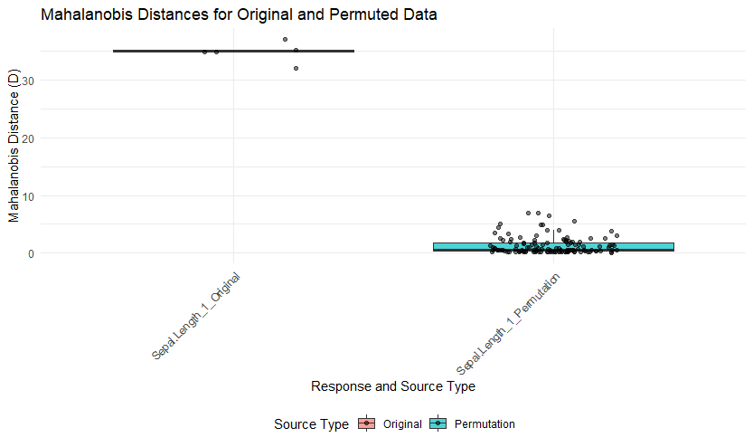
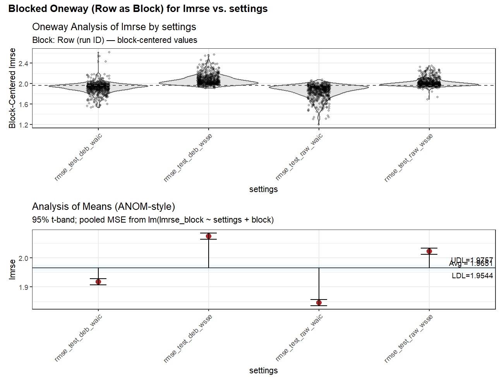

# Version
version `r utils::packageVersion("SVEMnet")`

# Summary

`SVEMnet` implements Self-Validated Ensemble Models (SVEM, Lemkus et al. 2021) and the SVEM whole model test (Karl 2024) using Elastic Net regression via the `glmnet` package Friedman et al. (2010). This vignette provides an overview of the package’s functionality and usage.


# Preface - Note from the author

The motivation to create the `SVEMnet` package was primarily to have a personal sandbox to explore SVEM performance in different scenarios and with various modifications to its structure. As noted in the documentation, I used `GPT o1-preview` to help form the code structure of the package and to code the Roxygen structure of the documentation. I have subsequently used more recent versions for auditing. The SVEM significance test R code comes from the supplementary material of Karl (2024). I wrote that code by hand and validated each step (not including the creation of the SVEM predictions) against corresponding results in JMP (the supplementary material of Karl (2024) provides the matching JSL script). For the `SVEMnet()` code, assuming only a single value of alpha for `glmnet` is being tested, the heart of the SVEM code is simply


```r
#partial code for illustration of the SVEM loop
coef_matrix <- matrix(NA, nrow = nBoot, ncol = p + 1)
 for (i in 1:nBoot) {
      U <- runif(n)
      w_train <- -log(U)
      w_valid <- -log(1 - U)
      #match glmnet normalization of training weight vector
      w_train <- w_train * (n / sum(w_train))
      w_valid <- w_valid * (n / sum(w_valid))
      glmnet(
          X, y_numeric,
          alpha = alpha,
          weights = w_train,
          intercept = TRUE,
          standardize = standardize,
          maxit = 1e6,
          nlambda = 500
      )
      predict(fit, newx = X)
      val_errors <- colSums(w_valid * (y_numeric - pred_valid)^2)
      k_values <- fit$df
      n_obs <- length(y_numeric)
      aic_values <- n_obs * log(val_errors / n_obs) + 2 * k_values
         # Choose lambda
      if (objective == "wSSE") {
        idx_min <- which.min(val_errors)
        lambda_opt <- fit$lambda[idx_min]
        val_error <- val_errors[idx_min]
      } else if (objective == "wAIC") {
        idx_min <- which.min(aic_values)
        lambda_opt <- fit$lambda[idx_min]
        val_error <- aic_values[idx_min]
      }
      coef_matrix[i, ] <- as.vector(coef(fit, s = lambda_opt))
}
```
However, to get this to a stable implementation that includes error and warning handling and structure to pass to S3 methods for `predict()`, `coef()`, `plot()`, etc, it was only practical for me to utilize help from GPT o1-preview. I simply would not have taken the time to add that structure otherwise, and my implementation would have been inferior. I reviewed any of the code that was generated from this tool before integrating it, and corrected its occasional mistakes. If someone would like to create a purely human-written set of code for a similar purpose, let me know and I will be happy to add links to your package and a description to the `SVEMnet` documentation.

Later revisions make use of later versions of GPT for code auditing, stress testing, and simulaiton. Many of the later entries in this vignette were written with GPT (code, analysis, summary). I will defend this by noting the material is not being submitted for publication, but is being presented to show various validaiton attempts for deviating from the published SVEM SSE objective and as a form of hypothesis generation for any future researchers that might be interested in working with SVEM. 


# SVEMnet Example 1

```{r,fig.width=6, fig.height=4}
library(SVEMnet)

# Example data
data <- iris
svem_model <- SVEMnet(Sepal.Length ~ ., data = data, nBoot = 300)
coef(svem_model)
```


Generate a plot of actual versus predicted values:

```{r,fig.width=6, fig.height=4}
plot(svem_model)
```


Predict outcomes for new data using the `predict()` function:

```{r}
predictions <- predict(svem_model, data)
print(predictions)
```


## Whole Model Significance Testing

This is the serial version of the significance test. It is slower but the code is less complicated to read than the faster parallel version.

```r
test_result <- svem_significance_test(Sepal.Length ~ ., data = data)
print(test_result)
plot(test_result)
SVEM Significance Test p-value:
[1] 0
```

```{r, echo=FALSE, out.width='100%', fig.cap="Whole model test result"}

```
Note that there is a parallelized version that runs much faster

```r
test_result <- svem_significance_test_parallel(Sepal.Length ~ ., data = data)
print(test_result)
plot(test_result)
SVEM Significance Test p-value:
[1] 0
```

# SVEMnet Example 2
```r
# Simulate data
set.seed(1)
n <- 25
X1 <- runif(n)
X2 <- runif(n)
X3 <- runif(n)
X4 <- runif(n)
X5 <- runif(n)

#y only depends on X1 and X2
y <- 1 + X1 +  X2 + X1 * X2 + X1^2 + rnorm(n)
data <- data.frame(y, X1, X2, X3, X4, X5)

# Perform the SVEM significance test
test_result <- svem_significance_test_parallel(
  y ~ (X1 + X2 + X3)^2 + I(X1^2) + I(X2^2) + I(X3^2),
  data = data

)

# View the p-value
print(test_result)
SVEM Significance Test p-value:
[1] 0.009399093


test_result2 <- svem_significance_test_parallel(
  y ~ (X1 + X2 )^2 + I(X1^2) + I(X2^2),
  data = data
)

# View the p-value
print(test_result2)
SVEM Significance Test p-value:
[1] 0.006475736

#note that the response does not depend on X4 or X5
test_result3 <- svem_significance_test_parallel(
  y ~ (X4 + X5)^2 + I(X4^2) + I(X5^2),
  data = data
)

# View the p-value
print(test_result3)
SVEM Significance Test p-value:
[1] 0.8968502

# Plot the Mahalanobis distances
plot(test_result,test_result2,test_result3)
```
```{r, echo=FALSE, out.width='100%', fig.cap="Whole Model Test Results for Example 2"}
knitr::include_graphics("figures/whole_model_2.png")
```


# 21DEC2024: Add glmnet.cv wrapper

Newly added wrapper for cv.glmnet() to compare performance of SVEM to glmnet's native CV implementation.

# 14 AUG 2025 — Simulation highlights (fixed‑settings study)
We ran focused simulations to examine when debiasing and objective choice help, under `standardize=TRUE`, `alpha_set = c(1)`, SVEM weights, and disjoint train/test:

- **Boundary effect (n vs p_full).** Let `p_full` be the number of columns in the full model matrix (no intercept). Debiasing tends to **hurt** when `n_train_used / p_full < 1`, is mostly **neutral** near `approx 1`, and can **help modestly** when `> 1`.
- **Objective (`wAIC` vs `wSSE`).** `wAIC` generally produced lower test RMSE than `wSSE` across R²∈{0.3,0.7,0.9}, especially in tighter‑sample regimes; `wSSE` narrows the gap as `n/p_full` grows.
- **Debias default.** With lasso base learners and these settings, `debias = FALSE` is the safer default. Use `debias = TRUE` only when `n/p_full` is comfortably >1 or when you need JMP‑style outputs.

```{r show-file4, echo=FALSE, results='asis'}
raw_file3 <- readLines("debias_and_objective.R")
cat("```r\n")
cat(raw_file3, sep="\n")
cat("\n```\n")
```

```{r, echo=FALSE, out.width='100%', fig.cap="Simulation-blocked Residual LRMSE for different objective functions and debiasing"}

```


# 15 AUG 2025 — Objective choice and SVEM vs CV (focused simulations)

We ran a larger simulation study spanning mixtures of factor structures (main-effects, interactions, quadratics), signal levels (R² ∈ {0.30, 0.50, 0.70, 0.90}), factor correlations ρ ∈ {−0.9, −0.5, 0, 0.5, 0.9}, sparsity levels (density ∈ {0.05, 0.10, 0.20, 0.30, 0.50, 0.75}), and a range of undersaturated to oversaturated settings via offsets in n_used − p_full. All fits used standardize=TRUE. Both SVEM and cv.glmnet searched α ∈ {0, 0.5, 1}. SVEM used nBoot=200 and no debiasing.

**Headline findings**

- **Among SVEM objectives, AICc is the most reliable default.** Across the full grid, the geometric-mean (GM) RMSE ratios relative to cv.glmnet were:
  
  | Method (vs CV) | GM RMSE ratio |
  |----------------|---------------|
  | SVEM–AIC       | approx 1.049 |
  | SVEM–AICc      | approx 1.019 |
  | SVEM–wSSE      | approx 1.200 |

  So AICc improves meaningfully over AIC and wSSE in aggregate, reducing tail risk without giving up much average accuracy.

- **cv.glmnet remains a strong overall baseline.** On the same grid, cv.glmnet had the lowest average LRMSE and the most first-place finishes (rank counts: CV approx 8.6k firsts vs AICc approx 5.5k; AIC and wSSE lag behind). A simple regret analysis (“always pick X”) shows **Always-CV** has slightly lower mean regret than **Always-AICc** overall.

- **Where AICc shines:** 
  - In **low-to-moderate signal** (R² approx 0.3–0.5) and **tighter regimes** (n_used ≲ p_full), AICc’s GM ratio approaches 1 and often dips below 1 for some model families, with *much lower tail risk* (e.g., P[RMSE_AICc > 2× RMSE_CV] approx 0 across bins we examined).
  - Versus **SVEM–AIC**, AICc dominates broadly: AICc/AIC GM ratios < 1 across most bins, especially near and below the boundary (n_used − p_full ≤ 0).

- **Tail behavior matters.** When AIC or wSSE lose, they tend to lose **big** (heavy right tails in the RMSE ratio). AICc’s losses are rarer and smaller; its 90th percentile loss is substantially lower than AIC’s and far below wSSE’s.

- **Speed trade-off:** With nBoot=200, **SVEM is slower** than cv.glmnet (GM speedup approx 0.04, i.e., CV is ~25× faster on a geometric mean basis). If runtime is critical and the regime is not severely undersaturated/low-signal, cv.glmnet is a pragmatic default.

**Guidance**

- **SVEM objective default:** set `objective="wAICc"`. It is the best-performing and safest objective inside SVEM across diverse conditions.
- **When to prefer cv.glmnet:** if you want the strongest overall average accuracy or need speed, especially when n_used ≥ p_full and/or signal is moderate–high.
- **When to lean on SVEM–AICc:** low-signal or tight designs (n_used ≲ p_full) where tail risk and stability are priorities; or when you want the ensembling behavior for robustness.

*Notes:* All comparisons use disjoint train/test and log-RMSE summaries; both SVEM and CV searched α ∈ {0, 0.5, 1} with `standardize=TRUE`. Debiasing was **off** because it generally degraded test performance in these settings. Results are representative of the tested grid; users should feel free to focus simulations on their local regimes of interest.


**How we compute wAIC/wAICc (and what if n < k?)**

For each λ on the glmnet path, we score models on the **validation** side using SVEM’s fractional weights. Let w_i be validation weights normalized so Σw_i approx n. We define weighted MSE as MSE_w = SSE_w / Σw_i and replace n with an **effective validation size** n_eff = (Σw_i)^2 / Σw_i^2. Degrees of freedom k come from glmnet’s df **plus the intercept**. We then form:

- wAIC(λ)  = Σw_i · log(MSE_w) + 2·k_eff
- wAICc(λ) = wAIC(λ) + [2·k_eff·(k_eff+1)] / (n_eff − k_eff − 1)

To avoid pathologies we use a conservative k_eff = max(1, min(k, n−2)) and we **mask** any λ where the correction is undefined: if k ≥ n or k_eff ≥ n_eff − 1, that λ is marked **inadmissible** (score = +∞) and cannot be selected. So if someone asks, “how do you compute AICc when n < k?”, the answer is: **we don’t**—those candidates are explicitly excluded under the mask, and we only compare AICc where the correction is valid.

# 15 AUG 2025 — Mixture + categorical factor study (True.CDF)

Design & metric. We simulated mixture factors A–D (sum-to-one) and a two-level categorical factor E. Each method proposes an optimal recipe (A–E), and we score it by True.CDF (closer to 1 is better). We analyze within-block comparisons where a “block” is one simulated dataset (File.Name), so all methods face the same data. Methods: SVEM objectives AIC, AICc, SSE; baselines cv.glmnet (reported as “glmnet”) and JMP’s SVEM-LASSO_w_int.

Debiasing note. JMP’s SVEM-LASSO_w_int performs a post-lasso unpenalized refit (“debiasing”) by design and this cannot be turned off. SVEMnet runs with debias = FALSE (our earlier LRMSE grid showed debiasing often hurt test performance near/under the n_used ≲ p_full boundary). Despite that asymmetry, the True.CDF analysis below shows SVEMnet(AICc) tracks—and slightly edges—JMP on average regret and mean delta.

Regret definition (higher-is-better metric like True.CDF). For each block b and method m,
  score_{m,b} = True.CDF_{m,b}
  best_b = max_m score_{m,b}
  regret_{m,b} = best_b − score_{m,b}  (≥ 0; 0 if the method is best/tied best)
We report mean regret across blocks. (For lower-is-better metrics like RMSE, either negate the metric or take score − min_m score.)

SVEM objective choice (AIC vs AICc vs SSE). Across 2,296 paired blocks:

• Winner counts (SVEM-only): AICc = 1155, AIC = 659, SSE = 482.

• Paired True.CDF (means/medians):

  | Method | Mean True.CDF | Median True.CDF |
  |:------:|:--------------:|:---------------:|
  |  AIC   |     0.8375     |     0.9854      |
  | AICc   |     0.8694     |     0.9901      |
  |  SSE   |     0.8170     |     0.9719      |

• Paired deltas (positive favors first):
  – AICc − AIC: mean +0.03195, median approx 0, [10%,90%] = [−0.1789, +0.3566]
  – AICc − SSE: mean +0.05244, median approx 0, [10%,90%] = [−0.1944, +0.4683]
  – AIC  − SSE: mean +0.02050, median approx 0, [10%,90%] = [−0.00261, +0.02687]

• Mean regret vs best SVEM objective (lower is better):

  | Always pick… | Mean regret |
  |--------------|-------------|
  | AIC          | 0.0908      |
  | AICc         | 0.0589      |
  | SSE          | 0.1110      |

• By n_total × R² (means + AICc win rates): AICc tends to dominate AIC and SSE more clearly as R² rises and/or n_total increases. Examples:

  | n_total | R²  | mean(AIC) | mean(AICc) | mean(SSE) | WR[AICc>AIC] | WR[AICc>SSE] |
  |:------:|:---:|:---------:|:----------:|:---------:|:------------:|:------------:|
  | 16     | 0.3 | 0.728     | 0.801      | 0.719     | 0.572        | 0.591        |
  | 26     | 0.3 | 0.787     | 0.883      | 0.717     | 0.610        | 0.697        |
  | 26     | 0.7 | 0.939     | 0.976      | 0.896     | 0.655        | 0.721        |

SVEM AICc vs cv.glmnet. Overall, cv.glmnet remains a strong, fast baseline; AICc is close and sometimes wins in tighter/low-signal strata.
• Win rate: P(AICc > CV) = 0.453.
• Paired delta: mean(AICc − CV) = −0.00443, median = 0.
• Mean regret: Always-CV 0.0491 vs Always-AICc 0.0536.
• Stratified highlights: AICc slightly beats CV at n_total=16, R²∈{0.3,0.5} (means: 0.801 vs 0.781; 0.851 vs 0.843), breaks even at n_total=26, R²approx0.5–0.7, and trails CV in many high-R² bins.

SVEM AICc vs JMP’s SVEM-LASSO_w_int (debiasing ON). AICc closely tracks JMP and is modestly better on average.
• Win rate: P(AICc > JMP) = 0.497 (essentially a tie).
• Paired delta: mean(AICc − JMP) = +0.0111, median = 0.
• Mean regret: Always-JMP 0.0668 vs Always-AICc 0.0556 (AICc smaller).

League table (all blocks):

  | Metric             |   AIC   |  AICc  |  SSE   |   CV   |  JMP   |
  |:-------------------|:-------:|:------:|:------:|:------:|:------:|
  | Mean True.CDF      | 0.8375  | 0.8694 | 0.8170 | 0.8739 | 0.8583 |
  | Median True.CDF    | 0.9854  | 0.9901 | 0.9719 | 0.9907 | 0.9898 |
  | N blocks (non-NA)  |  2296   |  2296  |  2296  |  2296  |  2296  |

Takeaways for SVEMnet.
• Default objective: Use objective = "wAICc". It wins most blocks among SVEM objectives, has the best average/median True.CDF, and the lowest regret. SSE is not recommended as a default in this setting.
• Validation vs baselines: AICc is very close to cv.glmnet on this metric (slightly behind on average) and slightly ahead of JMP’s debiased SVEM-LASSO_w_int on mean regret and mean delta.
• When to prefer CV: If you want the best average across all scenarios and speed, cv.glmnet remains a pragmatic choice. If you want SVEM’s ensembling and more robust tails, use AICc inside SVEM.

Relation to our earlier LRMSE study. The earlier grid (evaluated on test RMSE / LRMSE) also found AICc > AIC, wSSE inside SVEM and cv.glmnet slightly ahead of AICc on average (GM ratio AICc/CV approx 1.019). This True.CDF study—implemented in a different simulation environment and targeting a different metric—confirms the same hierarchy: inside SVEM, AICc is the most reliable objective; cv.glmnet edges AICc on average but by a small margin. The new study additionally verifies that SVEMnet(AICc, no debias) performs on par with (and slightly lowers regret vs) JMP’s debiased SVEM-LASSO_w_int.

```{r show-file5, echo=FALSE, results='asis'}
raw_file4 <- readLines("svem_vs_lassoCV_par_v2.R")
cat("```r\n")
cat(raw_file4, sep="\n")
cat("\n```\n")
```


## Default SVEMnet settings (Aug 2025)

Added `objective = "wAICc"`.


**Chosen default:** `SVEMnet(..., objective = "wAICc")` and `predict(..., debias = FALSE)`.

**Rationale from focused simulations (head-to-head test RMSE, disjoint train/test):**
- **AICc vs AIC (inside SVEM):** AICc consistently outperformed AIC. In paired comparisons on log-RMSE, the geometric-mean (GM) ratio favored AICc (e.g., GM approx 0.875 when debias=FALSE), indicating materially lower test error for AICc across diverse settings.
- **Debiasing:** Turning debias **on** generally increased test error for both SVEM and glmnet (typical GM inflation approx **+3%**). Debias helped only in high-signal slices (e.g., R² ≳ 0.7), but tended to hurt near or below the `n/p_full` boundary. As a broad default, **debias=FALSE** is safer.
- **SVEM objectives hierarchy:** `wAICc` > `wAIC` ≫ `wSSE` in aggregate performance and tail risk. `wSSE` especially underperformed near boundary regimes.
- **glmnet (for context only):** cv.glmnet is a strong baseline and was very close to SVEM–AICc on average. However, since this package’s goal is to provide a robust SVEM implementation with consistent defaults across regimes, we select **AICc with debias off** as the package default and use glmnet primarily for comparison.

**Key practical implication:** Unless you have strong prior evidence of a high-signal regime *and* want JMP-style debiased outputs, keep `debias = FALSE`. AICc’s small-sample penalty stabilizes selection near tight designs and lowers tail losses without noticeably sacrificing average accuracy.

**Default usage:**
```r
# Fit with the recommended defaults
fit <- SVEMnet(
  y ~ (X1 + X2 + X3)^2 + I(X1^2) + I(X2^2) + I(X3^2),
  data = dat,
  objective = "wAICc",
  nBoot = 200,
  glmnet_alpha = c(0, 0.5, 1),
  weight_scheme = "SVEM",
  standardize = TRUE
)

# Predict with debias turned off (recommended default)
pred <- predict(fit, newdata = dat, debias = FALSE)
```
```{r show-file6, echo=FALSE, results='asis'}
raw_file6 <- readLines("debias_aicc_cvglm.R")
cat("```r\n")
cat(raw_file6, sep="\n")
cat("\n```\n")
```


## References and Citations


1. **Lemkus, T., Gotwalt, C., Ramsey, P., & Weese, M. L. (2021).** *Self-Validated Ensemble Models for Elastic Net Regression*.  
   *Chemometrics and Intelligent Laboratory Systems*, 219, 104439.  
   DOI: [10.1016/j.chemolab.2021.104439](https://doi.org/10.1016/j.chemolab.2021.104439)

2. **Karl, A. T. (2024).** *A Randomized Permutation Whole-Model Test for SVEM*.  
   *Chemometrics and Intelligent Laboratory Systems*, 249, 105122.  
   DOI: [10.1016/j.chemolab.2024.105122](https://doi.org/10.1016/j.chemolab.2024.105122)

3. **Friedman, J. H., Hastie, T., & Tibshirani, R. (2010).** *Regularization Paths for Generalized Linear Models via Coordinate Descent*.  
   *Journal of Statistical Software*, 33(1), 1–22.  
   DOI: [10.18637/jss.v033.i01](https://doi.org/10.18637/jss.v033.i01)

4. **Gotwalt, C., & Ramsey, P. (2018).** *Model Validation Strategies for Designed Experiments Using Bootstrapping Techniques With Applications to Biopharmaceuticals*.  
   *JMP Discovery Conference*.  
   [Link](https://community.jmp.com/t5/Abstracts/Model-Validation-Strategies-for-Designed-Experiments-Using/ev-p/849873/redirect_from_archived_page/true)

5. **Ramsey, P., Gaudard, M., & Levin, W. (2021).** *Accelerating Innovation with Space-Filling Mixture Designs, Neural Networks, and SVEM*.  
   *JMP Discovery Conference*.  
   [Link](https://community.jmp.com/t5/Abstracts/Accelerating-Innovation-with-Space-Filling-Mixture-Designs/ev-p/756841)

6. **Ramsey, P., & Gotwalt, C. (2018).** *Model Validation Strategies for Designed Experiments Using Bootstrapping Techniques With Applications to Biopharmaceuticals*.  
   *JMP Discovery Summit Europe*.  
   [Link](https://community.jmp.com/t5/Abstracts/Model-Validation-Strategies-for-Designed-Experiments-Using/ev-p/849647/redirect_from_archived_page/true)

7. **Ramsey, P., Levin, W., Lemkus, T., & Gotwalt, C. (2021).** *SVEM: A Paradigm Shift in Design and Analysis of Experiments*.  
   *JMP Discovery Summit Europe*.  
   [Link](https://community.jmp.com/t5/Abstracts/SVEM-A-Paradigm-Shift-in-Design-and-Analysis-of-Experiments-2021/ev-p/756634)

8. **Ramsey, P., & McNeill, P. (2023).** *CMC, SVEM, Neural Networks, DOE, and Complexity: It's All About Prediction*.  
   *JMP Discovery Conference*.

9. **Karl, A., Wisnowski, J., & Rushing, H. (2022).** *JMP Pro 17 Remedies for Practical Struggles with Mixture Experiments*.  
   *JMP Discovery Conference*.  
  [Link](https://doi.org/10.13140/RG.2.2.34598.40003/1)

10. **Xu, L., Gotwalt, C., Hong, Y., King, C. B., & Meeker, W. Q. (2020).** *Applications of the Fractional-Random-Weight Bootstrap*.  
    *The American Statistician*, 74(4), 345–358.  
   [Link](https://doi.org/10.1080/00031305.2020.1731599)

11. **Karl, A. T. (2024).** *SVEMnet: Self-Validated Ensemble Models with Elastic Net Regression*.  
    R package

12. **JMP Help Documentation** *Overview of Self-Validated Ensemble Models*.  
    [Link](https://www.jmp.com/support/help/en/18.1/?utm_source=help&utm_medium=redirect#page/jmp/overview-of-selfvalidated-ensemble-models.shtml)


